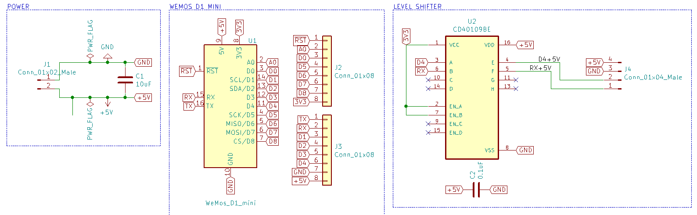

# LED Controller Board - Wemos D1 Mini

This is a simple board that adds a logic level shifter to the D4 and RX pins
of a Wemos D1 Mini. With +5V and Ground output pins as well it makes a handy
little board for controlling short runs of LED light strips that don't require a
big external power supply.

## Schematic

A [printable version of the schematic](schematic.pdf) is available in PDF format.

## Bill of Materials

| Symbol | Description                                  | Quantity | Source                                                                                                         | Notes                                                                                                            |
| ------ | -------------------------------------------- | -------- | -------------------------------------------------------------------------------------------------------------- | ---------------------------------------------------------------------------------------------------------------- |
| C1     | 10 uF ceramic capacitor                      | 1        | [DigiKey](https://www.digikey.com/product-detail/en/tdk-corporation/FG16X7R1E106KRT06/445-173156-1-ND/5811761) | 2.5mm lead spacing                                                                                               |
| C2     | 0.1 uF ceramic capacitor                     | 1        | [DigiKey](https://www.digikey.com/product-detail/en/kemet/C322C104M5U5TA/399-4331-ND/818107)                   | 5mm lead spacing                                                                                                 |
| J1     | Molex KK male two pin right angle connector  | 1        | [DigiKey](https://www.digikey.com/product-detail/en/molex/1718570002/WM10157-ND/4423113)                       |                                                                                                                  |
| J2     | 1x8 2.54mm female pin header                 | 1        |                                                                                                                | This comes with the Wemos D1 Mini                                                                                |
| J3     | 1x8 2.54mm female pin header                 | 1        |                                                                                                                | This comes with the Wemos D1 Mini                                                                                |
| J4     | Molex KK male four pin right angle connector | 1        | [DigiKey](https://www.digikey.com/product-detail/en/molex/1718570004/WM10159-ND/4423115)                       |                                                                                                                  |
| U1     | Wemos D1 Mini                                | 1        | [Amazon](https://www.amazon.com/gp/product/B076F52NQD)                                                         | Header pins come with this set from Amazon so there is no need to buy additional headers to solder to the board. |
| U2     | TI CD40109BPWR unidirectional level shifter  | 1        | [DigiKey](https://www.digikey.com/product-detail/en/texas-instruments/CD40109BPWR/296-12163-1-ND/412005)       |                                                                                                                  |

## Ordering the PCB

The PCB can easily be ordered from PCBWay. They're cheap, great quality, and arrive quickly.
